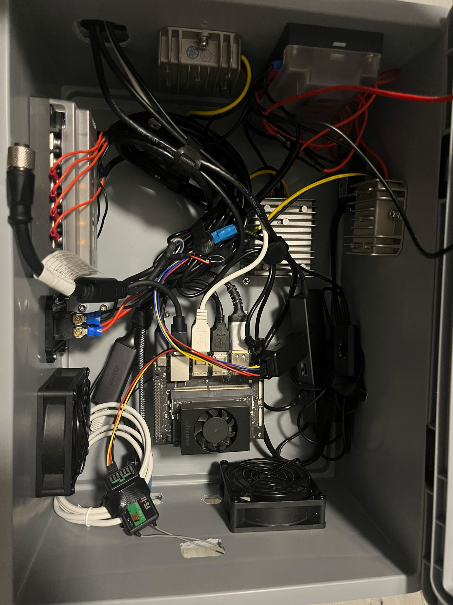

# Autonomous-Mobile-Robot

This project involves the development of a **4WD Skid Steer Mobile Robot Platform** using multiple sensors for perception and navigation. The system is designed to operate autonomously in various environments, utilizing real-time sensor data for decision-making and path planning.


## Project Timeline
**Start Date:** June 2026
**Current Status:** In Development

## Demo

A short video of the platform driving is available on YouTube:

[](https://youtube.com/shorts/lYS1PFD3IEY?feature=share)

▶️ **[4WD Skid Steer Robot — driving demo](https://youtube.com/shorts/lYS1PFD3IEY?feature=share)**

## Components

The following components are used in the development of the Autonomous Mobile Robot:

- **Livox Mid 360 LiDAR:** Provides 360-degree 3D scanning of the surrounding environment to detect objects and obstacles.
- **Intel Realsense d456:** Depth camera for capturing high-resolution depth data, enabling 3D mapping and perception.
- **TI AWR1843Boost Radar Sensor with DCA1000EVA FPGA board:** Radar sensor for robust object detection, even in low-visibility conditions (e.g., fog, dust).
- **Jetson Orin NX 16GB:** NVIDIA Jetson development platform that serves as the robot's primary computing unit, handling sensor data processing, AI computations, and control systems.
- **4x DDSM115 brushless hub motors:** Direct-drive wheel motors driven over RS485, one channel per wheel.
- **Waveshare USB to 4-Channel RS485 adapter:** Bridges the Jetson to the four motors (`/dev/ttyACM0`–`/dev/ttyACM3` for FL, FR, RL, RR).
- **FS-iA RC receiver:** Manual/teleoperation and remote failsafe input.

## Electronics & Wiring

All compute, power conversion and control electronics are housed in a sealed enclosure on the chassis:



Layout of the enclosure:

- **Compute:** Jetson Orin NX 16GB on its carrier board (center), with an active heatsink fan.
- **Power distribution:** Battery feeds a fused terminal/distribution block (left) that fans out to each subsystem on the red/black harness.
- **DC-DC conversion:** Step-down converter modules (finned aluminium heatsinks) drop the battery voltage to the rails required by the Jetson, sensors and the RS485 adapter.
- **Motor bus:** RS485 wiring from the 4-channel USB adapter leaves the box to the four DDSM115 hub motors.
- **RC link:** FS-iA receiver (bottom left) for manual driving and remote stop.
- **Data links:** Cat6 Ethernet for the Livox Mid 360, USB 3.0 for the RealSense d456 and the radar/DCA1000, routed to the Jetson.
- **Thermal management:** Two enclosure fans for forced-air cooling.
- **External connectors:** Panel-mounted aviation connectors carry power and sensor cabling out of the enclosure.

## Base Controller

Low-level motion control is handled by a separate ROS 2 package:

👉 **[robot_4wd_dds115_base_controller_ros2](https://github.com/rsazid99/robot_4wd_dds115_base_controller_ros2)**

A ROS 2 Jazzy C++ node that drives the four DDSM115 hub motors over RS485 and closes the loop between `/cmd_vel` and wheel odometry.

| | |
|---|---|
| **Subscribes** | `/cmd_vel` (`geometry_msgs/Twist`) |
| **Publishes** | `/wheel_odom`, `/motor_rpms`, `/motor_currents`, TF |
| **Hardware** | 4x DDSM115 (IDs 1–4), Waveshare USB→4Ch RS485 @ 115200 baud |
| **Features** | Skid-steer/differential kinematics, velocity ramping, command watchdog, CRC-8/MAXIM framed RS485 protocol, threaded TX/feedback polling |

Launch it with:

```bash
ros2 launch robot_4wd_dds115_base_controller base_controller.launch.py
```

Wheel geometry, motor-to-channel assignment and control rates are configured in `config/base_controller.yaml`.

## Features
- **Multi-Sensor Fusion:** Combines data from LiDAR, Stereo Depth camera, and radar for improved perception and decision-making.
- **Real-Time 3D Mapping:** The robot constructs a 3D map of its environment using LiDAR or RGB-D data.
- **Autonomous Navigation:** The robot plans and follows its path based on sensor data, allowing it to move autonomously in complex environments by avoiding obstacles.
- **Closed-Loop Base Control:** Wheel odometry and per-motor telemetry from the DDSM115 base controller feed the navigation stack.

## Getting Started

### Prerequisites

Before setting up the project, make sure you have the following:

- **NVIDIA Jetson Orin NX 16GB** with JetPack SDK installed
- ROS2 installed on the Jetson platform
- Libraries and drivers for each sensor:
  - [Livox SDK](https://github.com/Livox-SDK/Livox-SDK2)
  - [Intel Realsense SDK](https://github.com/IntelRealSense/librealsense)
- Base controller package: [robot_4wd_dds115_base_controller_ros2](https://github.com/rsazid99/robot_4wd_dds115_base_controller_ros2)
