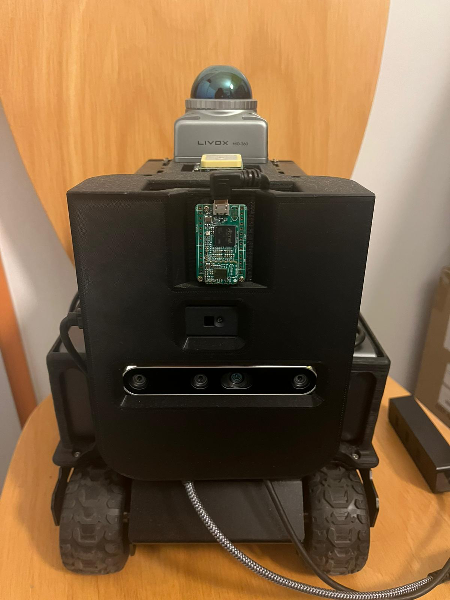

# Autonomous-Mobile-Robot-Mr.-Hexo

This project involves the development of an **Autonomous Mobile Robot** using multiple sensors for perception and navigation. The system is designed to operate autonomously in various environments, utilizing real-time sensor data for decision-making and path planning.

## Project Timeline
**Start Date:** January 2024  
**Current Status:** In Development

## Components

The following components are used in the development of the Autonomous Mobile Robot:

- **Livox Mid 360 LiDAR:** Provides 360-degree 3D scanning of the surrounding environment to detect objects and obstacles.
- **Intel Realsense d456:** Depth camera for capturing high-resolution depth data, enabling 3D mapping and perception.
- **Pmd Flexx2 ToF Camera:** Time-of-Flight (ToF) camera that provides accurate distance measurements using infrared light.
- **Infineon BGT60TR13C Radar Sensor:** Radar sensor for robust object detection, even in low-visibility conditions (e.g., fog, dust).
- **Jetson Orin NX 16GB:** NVIDIA Jetson development platform that serves as the robot's primary computing unit, handling sensor data processing, AI computations, and control systems.

## Features

- **Real-Time 3D Mapping:** The robot constructs a 3D map of its environment using LiDAR, depth, and ToF data.
- **Obstacle Detection and Avoidance:** Integration of multiple sensor inputs to detect and avoid obstacles in real-time.
- **Autonomous Navigation:** The robot plans and follows its path based on sensor data, allowing it to move autonomously in complex environments.
- **Multi-Sensor Fusion:** Combines data from LiDAR, depth camera, ToF camera, and radar for improved perception and decision-making.

## Getting Started

### Prerequisites

Before setting up the project, make sure you have the following:

- **NVIDIA Jetson Orin NX 16GB** with JetPack SDK installed
- Ubuntu-based development environment
- ROS2 installed on the Jetson platform
- Libraries and drivers for each sensor:
  - [Livox SDK](https://github.com/Livox-SDK/Livox-SDK2)
  - [Intel Realsense SDK](https://github.com/IntelRealSense/librealsense)
  - [Pmd Flexx2 SDK](https://3d.pmdtec.com/en/royale-software/)
  - [Infineon Radar SDK](https://www.infineon.com/cms/de/product/sensor/radar-sensors/radar-sensors-for-iot/60ghz-radar/bgt60tr13c/?tab=~%27development_tools#!designsupport)
